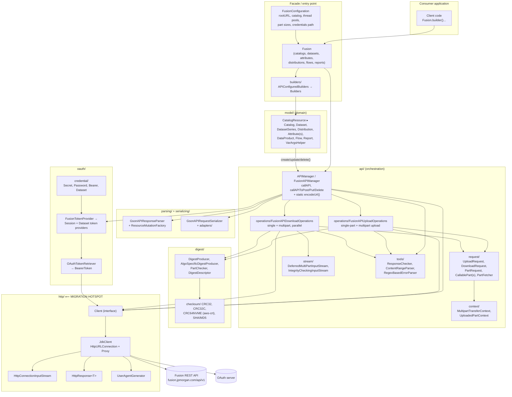

# Fusion Java SDK — Java 8 → Java 17 Migration Plan

**Repository:** `esteechenyiwei/fusion-java-sdk` (`io.github.jpmorganchase.fusion:fusion-sdk`)
**Working branch:** `practice-3` (branched from `main` @ `ac88da4`)
**Author:** migration working document
**Goal:** run, build and ship the SDK on Java 17 (LTS) while preserving the public SDK API and observable behaviour for existing consumers.

---

## 1. Executive summary

| | |
|---|---|
| **Current state** | `maven.compiler.source/target = 1.8`; CI builds on Temurin 8; several dependencies pinned to last-Java-8-compatible versions; HTTP layer built on `HttpURLConnection`. |
| **Target state** | `maven.compiler.release = 17`; CI on Temurin 17; Java-8 pins removed; language constructs modernised; HTTP layer on `java.net.http.HttpClient`. |
| **Public API impact** | None intended. Package/class/method signatures unchanged. The only *binary* impact is the class-file version (52.0 → 61.0), i.e. **consumers must be on Java 17+**. |
| **Baseline (measured)** | `mvn clean verify` on `main` is **green**: 352 unit tests, 1 integration test, line coverage 87 %, PIT mutation score 86 % against a **threshold of 85 %** (only 1 pt of headroom — see risk R3). |
| **Effort** | ~2–3 engineer-days of change + review, split over 3 phases that are independently shippable. |

### Why this migration matters

**For engineers**
* Java 8 (public updates) is out of free support for most distributions; JDK 17 is the current widely-adopted LTS with security patches through at least 2029. Staying on 8 means unpatched JVM CVEs and an ever-shrinking library ecosystem.
* Half the dependency table is *frozen* purely by Java 8 (`logback 1.3.x`, `spotless 2.30.0`, `wiremock-jre8`, Mockito 4.x). Every one of those pins is a security-patch dead end, and they block adoption of tooling the rest of the org already uses.
* Modern constructs (switch expressions, `var`, records-ready code, text blocks) cut boilerplate and remove whole classes of bugs (non-exhaustive switches, fall-through).
* `java.net.http.HttpClient` replaces a 1997-era API that has no connection pooling control, no HTTP/2, no timeouts by default, and awkward error-stream handling.

**For business users of the SDK (Fusion data consumers)**
* **Security posture:** a JDK-17 artifact lets client teams run the SDK on a supported, patched runtime — a hard requirement for most production risk/controls reviews inside and outside the bank.
* **Performance:** HTTP/2 multiplexing plus real connection reuse directly improves the multipart upload/download paths that dominate large Fusion distribution transfers.
* **Longevity:** consumers stuck on a Java-8-only SDK will eventually be unable to consume new Fusion API features. Migrating now, on a clean major/minor boundary, gives them a predictable upgrade point.
* **Zero code change on their side:** because the public API is unchanged, upgrading is a version bump plus a runtime upgrade — not a rewrite.

---

## 2. Architecture of the code base

### 2.1 Component diagram



### 2.2 Request lifecycle (what a call actually does)

```
Fusion.dataset("SD0001")            Fusion facade
  └─ APIManager.callAPI(path)       adds Fusion-Authorization + Bearer headers
       ├─ FusionTokenProvider       session token (cached, expiry-aware)
       │    └─ OAuthTokenRetriever  ──► OAuth server (POST/GET via Client)
       ├─ Client.get(path, headers) ──► Fusion API   ◄── MIGRATION HOTSPOT
       ├─ ResponseChecker           4xx/5xx → APICallException
       └─ GsonAPIResponseParser     JSON → model objects (+ VarArgs, + Fusion back-ref)
```

Upload/download add: `DigestProducer` (checksums), `PartFetcher`/`CallableParts` (parallel part transfer on an `ExecutorService`), `MultipartTransferContext` (initiate → transfer → complete), and `IntegrityCheckingInputStream` (digest-of-digests verification).

### 2.3 Where Java 8 is baked in today

| Location | Java-8 artefact | Phase |
|---|---|---|
| `pom.xml` properties | `maven.compiler.source/target = 1.8` | 1 |
| `pom.xml` `logback-classic 1.3.12` | comment: *"logback >1.3.x does not support JDK8"* | 1 |
| `pom.xml` `spotless-maven-plugin 2.30.0` | comment: *"Later versions require Java version > 8"* | 1 |
| `pom.xml` `wiremock-jre8 2.35.2` | JRE8-specific WireMock distribution | 1 |
| `pom.xml` Mockito 4.x, JUnit 5.9.2, Pact 4.1.x | last comfortable Java-8 lines | 1 |
| `.github/workflows/build.yml`, `release.yml` | `java-version: 8` | 1 |
| `APICallException`, `DigestProviderService`, `OAuthTokenRetriever` | classic `switch` statements with `break`/fall-through | 2 |
| `JdkClient`, `APIManager.encodeUrl` | `new URL(String)`, `URLEncoder.encode(s, "UTF-8")` | 2 |
| Various | `Arrays.asList`, `new ArrayList<>()` constants, `size() > 0`, verbose generics | 2 |
| `http/JdkClient` + `HttpConnectionInputStream` | `HttpURLConnection` transport | 3 |

---

## 3. Phased plan

Each **step** is a single commit and ends with the same validation gate:

```bash
mvn -B clean verify          # spotless:check → compile → 352 unit tests → PIT (≥85%) → package → failsafe ITs
```

A step is only "done" when that command exits 0. Failure = fix or revert the step, never advance.

### Phase 0 — Baseline (done)

| Step | Action | Why |
|---|---|---|
| 0.1 | Create branch `practice-3` off `main`. | Keeps `main` releasable; migration is reviewable as one PR. |
| 0.2 | Run `mvn clean verify` unchanged. | You cannot attribute a failure to the migration unless you know the pre-migration state. **Result: green** — 352 tests, 87 % line coverage, 86 % mutation score, 1 IT. |
| 0.3 | Record existing warnings/issues. | Found: (a) `bootstrap class path not set in conjunction with -source 8` — the classic silent-API-leak warning that `release` fixes; (b) mutation score 86 % vs 85 % threshold — **1 point of headroom**; (c) local builds needed a Maven Central mirror (HTTP 429 on this host) — environment-only, not a repo issue. |

**Why it matters (business):** a recorded green baseline is the evidence a change-approval board needs to accept that any later regression came from the migration, not from pre-existing debt.

### Phase 1 — Toolchain and dependency modernisation (low effort, high impact)

| Step | Action | Why it matters |
|---|---|---|
| 1.1 | `pom.xml`: replace `maven.compiler.source/target=1.8` with `<maven.compiler.release>17</maven.compiler.release>`. | `release` (unlike `source`/`target`) *validates against the JDK 17 API signature set*, eliminating the "compiles on 17, `NoSuchMethodError` at runtime" class of bug and the bootstrap-classpath warning. This is the single change that makes the artifact a Java 17 artifact. |
| 1.2 | CI: `java-version: 8 → 17` in `build.yml` **and** `release.yml`. | The release pipeline must build the exact bytecode we tested. Leaving `release.yml` on 8 would publish a broken/unbuildable release. |
| 1.3 | Remove Java-8 pins: `logback-classic 1.3.12 → 1.5.x`, `spotless 2.30.0 → 2.4x`, drop the explanatory "Java 8" comments. | These pins exist *only* because of Java 8. Unpinning restores the security-patch stream for the logging stack and the formatter, and removes misleading comments for future maintainers. |
| 1.4 | Test-stack refresh: `com.github.tomakehurst:wiremock-jre8 2.35` → `org.wiremock:wiremock 3.13`, JUnit 5.9.2 → 5.14, Mockito 4.x → 5.20, `pitest` 1.9.8 → 1.20 with `pitest-junit5-plugin` 1.2.3. **Pact 4.1.41 deliberately left as-is** — 4.4+ defaults to the V4 pact spec and requires rewriting every `@Pact` method signature, which would also change the published `-pact` classifier artifact's contract files. That is consumer-visible and belongs in its own change, not in a JDK migration. | `wiremock-jre8` is a dead artifact name; Mockito 5 is the first line that supports JDK 17 byte-buddy properly (inline mock maker by default). Without these, tests will pass today and break on the next JDK bump. **Known trap:** PIT + JUnit 5.12 needs `pitest-junit5-plugin ≥ 1.2.x` or mutation coverage silently drops to 0 and fails the 85 % gate. |
| 1.5 | `README.md`: state the Java 17 requirement. | Consumers must know before they upgrade; this is the cheapest form of release communication. |
| **Gate** | `mvn -B clean verify` green after **each** of the above. | |

**Business value:** after Phase 1 the SDK is *shippable on 17* with essentially zero behavioural risk — this is the phase that unblocks client teams' security reviews.

### Phase 2 — Language and API modernisation (medium effort, medium impact)

| Step | Action | Why it matters |
|---|---|---|
| 2.1 | Arrow-form **switch expressions** in `APICallException.getMessage()`, `DigestProviderService.getDigestProvider()`, `OAuthTokenRetriever.retrieve()`. | Removes fall-through bugs and the mutable `errorMsg` accumulator; the compiler now enforces that every branch yields a value. `APICallException.getMessage()` is *consumer-visible* text — messages are preserved verbatim, only the control flow changes. |
| 2.2 | `new URL(String)` → `URI` in `JdkClient` (landed in Phase 3); `URLEncoder.encode(s, StandardCharsets.UTF_8)` instead of the `String`-charset overload (which throws a checked `UnsupportedEncodingException` nobody can handle). **`APIManager.encodeUrl` deliberately keeps `new URL(...)`** — see note below. | `new URL(String)` is deprecated for removal from JDK 20 — fixing it now means the next LTS hop (21/25) is a no-op. Removing the impossible checked exception simplifies `encodeUrl`'s signature internals without changing its public contract. |
| 2.3 | Immutable collection factories and small idioms: `List.of`/`Map.of`/`Collections.emptyList()` where a mutable copy isn't required, `isEmpty()` instead of `size() > 0`, diamond/`var` where it genuinely improves readability. | Fewer defensive copies and accidental mutation of shared state. **Caution:** `List.of` rejects `null` elements and Gson-populated maps can carry nulls — applied only where a null is impossible. |
| 2.4 | Text blocks in test fixtures where a multi-line JSON literal exists. | Test readability only; zero production impact. |
| **Gate** | `mvn -B clean verify` green after each step; `spotless:apply` before committing. | |

**Business value:** none of this changes behaviour — it lowers the cost of every *future* change to the SDK, which is what keeps Fusion feature delivery fast for consumers.

> **Deliberate exception — `APIManager.encodeUrl`.** That method exists to percent-encode raw path segments that may legitimately contain spaces or Unicode. `URI` rejects exactly those characters at parse time, so swapping `new URL(rawUrl)` for `URI.create(rawUrl)` there would reject the inputs the method was written to handle. It stays on `URL` (with an explanatory comment) until the *callers* are changed to hand it pre-validated input; `JdkClient` moved to `URI` safely because its input is already encoded by that method.

### Phase 3 — HTTP transport rewrite (high effort, high impact)

| Step | Action | Why it matters |
|---|---|---|
| 3.1 | Rewrite `JdkClient` on `java.net.http.HttpClient`, keeping the `Client` interface, the `JdkClient.builder()` shape (`.url()/.port()/.noProxy()`), and `HttpResponse<T>` **unchanged**. | The `Client` interface is the seam every other component talks to; keeping it means `FusionAPIManager`, upload/download operations and `OAuthTokenRetriever` are untouched — the blast radius stays inside one package. |
| 3.2 | Map behaviour 1:1: `BodyHandlers.ofInputStream` everywhere (text bodies read through the same line-joining reader as before), `BodyPublishers.ofByteArray` for stream PUTs, `ProxySelector` for the proxy builder, `HTTP_1_1` + `Redirect.NORMAL` to match `HttpURLConnection` defaults. | Behavioural parity is the whole game: consumers must not see different exceptions, status handling or error text. The 35 existing `JdkClientTest` cases (WireMock-backed) are the contract. See the parity notes below for the three places where exact parity was impossible or undesirable. |
| 3.3 | Delete `HttpConnectionInputStream` (+ its test) — `HttpClient`'s `InputStream` body already owns connection release. | Dead code after 3.2; leaving it invites a future maintainer to wire a raw `HttpURLConnection` back in. Note: this is an SDK-internal, package-private class — **not** part of the public API. |
| 3.4 | Re-verify multipart upload/download and PACT/WireMock suites specifically. | These are the paths where connection reuse and streaming semantics differ most between the two clients, and where Fusion's largest client workloads live. |
| **Gate** | `mvn -B clean verify` green; PIT mutation score still ≥ 85 %. | |

**Business value:** a single pooled `HttpClient` per SDK client on the parallel part-transfer paths is the throughput win consumers will actually feel on large distributions; it also opens the door to per-request timeouts and HTTP/2, which the old client never had.

#### Phase 3 transport parity notes (consumer-relevant)

| Area | Old (`HttpURLConnection`) | New (`java.net.http.HttpClient`) | Rationale |
|---|---|---|---|
| **Protocol / redirects** | HTTP/1.1, follows redirects by default | Pinned to `HTTP_1_1` and `Redirect.NORMAL` | Parity chosen over novelty. HTTP/2 is a follow-up to be enabled deliberately and load-tested, not smuggled into a JDK migration. |
| **Request framing** | Body buffered in memory, sent with `Content-Length` | Buffered to `byte[]`, sent with `Content-Length` | `BodyPublishers.ofInputStream` would have switched large part uploads to chunked encoding — a wire-visible change against the Fusion API. Memory profile is unchanged from today. Streaming with a known length is a follow-up. |
| **Transport-owned headers** | `Content-Length` etc. set by callers were silently replaced | Caller-supplied `connection`/`content-length`/`expect`/`host`/`upgrade` are dropped before the request is built | `HttpClient` *throws* on these by default. `FusionAPIUploadOperations` sets `Content-Length` on single-part uploads, so without this filter every single-part upload would fail. Net wire result is identical, because the transport computes the real value. |
| **Empty error bodies** | `getErrorStream() == null` → synthetic `{"error": "Unable to perform requested action"}` | Empty body → `""` | The synthetic body existed to paper over a `HttpURLConnection` quirk that `HttpClient` does not have. An error response *with* an empty body already produced `""` before (asserted by the 404/500 tests), so the observable contract is unchanged; only the unreachable null-stream path is gone. |
| **Invalid URLs** | `new URL("http://h/a b")` accepted, then produced a malformed request line | Rejected up front with `ClientException("Malformed URL path received: …")` | Fails fast with the same exception type and message format instead of emitting a request the server will 400. |
| **Interruption** | n/a (blocking IO, no `InterruptedException`) | Interrupt flag restored, then `ClientException("Interrupted while performing HTTP operation")` | The multipart paths run on a thread pool; swallowing the interrupt would break cancellation. |

### Phase 4 — Package, publish-readiness and rollout

| Step | Action |
|---|---|
| 4.1 | `mvn -B clean package` → `target/fusion-sdk-<version>.jar` (+ `-sources`, `-javadoc`, `-pact`). Verify class-file major version = **61** (`javap -v` / `unzip -p ... \| head -c 8`). |
| 4.2 | Push `practice-3`; confirm the GitHub Actions **Build** workflow is green on Java 17. |
| 4.3 | Open PR into `main` documenting API impact and the consumer-facing runtime requirement. |

---

## 4. Downstream compatibility implications

| Aspect | Impact | Notes |
|---|---|---|
| **Source compatibility** | **None.** | No public class, method, or constructor signature is added, removed or changed. Consumer code compiles unchanged. |
| **Binary compatibility** | **Breaking on runtime only.** | Class files move from major version 52 (Java 8) to 61 (Java 17). Anything still running a JRE 8/11 gets `UnsupportedClassVersionError` at load time — a loud, immediate, unambiguous failure, not a silent corruption. |
| **Behavioural compatibility** | **Intended: none.** | Exception types, HTTP status handling and `APICallException` message strings are preserved verbatim. Phase 3 is the only step with real behavioural risk (see R1). |
| **Transitive dependencies** | Logback/WireMock/Mockito changes are **test/optional scope**; `logback-classic` is `test` scope and never reaches consumers. Runtime deps (`gson`, `slf4j-api`, `aws-crt`) are unchanged in Phase 1–3. | Consumers on old Logback are unaffected. |
| **Consumers on Java 8/11** | Must stay on the last 0.0.x Java-8 release, or upgrade their runtime. | This is why the Java-8 line should be tagged and documented before the 17 line is published (see §6). |
| **Maven Central coordinates** | Unchanged (`io.github.jpmorganchase.fusion:fusion-sdk`). | A JDK-17 baseline is conventionally signalled by a **minor/major version bump**, not a classifier. |

### Risk register

| ID | Risk | Likelihood | Mitigation |
|---|---|---|---|
| R1 | Phase 3 transport rewrite changes an edge-case behaviour (redirects, empty error body, header casing, proxy auth). | Medium | Keep `Client`/`HttpResponse` fixed; rely on the 35 WireMock `JdkClientTest` cases + PACT suites as the contract; ship Phase 3 as its own commit so it can be reverted independently. |
| R2 | Test-library upgrades (Mockito 5, WireMock 3) change mocking/stubbing semantics. | Medium | Upgrade one library per commit, `mvn verify` after each; if a library fights back, defer it — it is not on the critical path to a Java 17 artifact. |
| R3 | PIT mutation gate (85 %) trips because deleting code (e.g. `HttpConnectionInputStream`) shifts the score. | Medium — baseline is only 86 % | Re-check the score after every deletion; if it dips, add targeted tests rather than lowering the threshold. |
| R4 | Consumers silently pick up the new jar and fail at class-load on Java 8. | High if uncommunicated | Version bump + release notes + `README` requirement + prior notice (see §6). |
| R5 | Release pipeline still on Java 8 publishes mismatched bytecode. | Low | Step 1.2 changes `release.yml` in the same commit as `build.yml`. |

---

## 5. Validation strategy

1. **Per-step gate:** `mvn -B clean verify` (spotless check, compile, 352 unit tests, PIT ≥ 85 %, package, failsafe ITs). No step advances on red.
2. **Bytecode check:** confirm major version 61 in the packaged jar.
3. **Contract checks:** PACT consumer tests + WireMock ITs exercise the real request/response shapes against stubs — these are the closest thing to a Fusion-API integration test available offline.
4. **CI check:** GitHub Actions **Build** workflow on `practice-3` must be green on Temurin 17.
5. **Pre-release (recommended, outside this branch):** smoke-test the packaged jar against a real Fusion tenant — one catalog list, one small download, one >50 MB multipart upload — since neither WireMock nor PACT exercises real network/TLS/proxy behaviour.

---

## 6. Next steps after this branch merges

### 6.1 Release path

1. **Tag the Java 8 line first.** Cut and document the final Java-8-compatible release (e.g. `0.0.19`) from `main` *before* the 17 line lands, so consumers who cannot move have a supported, quotable artifact.
2. **Version signal.** Publish the first Java 17 build as a **minor/major bump** (e.g. `0.1.0`, or `1.0.0` if the team wants to make the runtime break unmistakable) — never as a patch on the 8 line. Semantic signalling is the cheapest protection against R4.
3. **Publish a pre-release first.** Push a `-SNAPSHOT`/RC to a staging repo, have 1–2 friendly internal consumers build against it, then run `release.yml` (which is already GPG-signing and publishing to Maven Central via `central-publishing-maven-plugin`).
4. **Release notes must state:** minimum runtime = Java 17; no source changes required; `HttpURLConnection` → `java.net.http.HttpClient` internally; list any behavioural notes discovered in Phase 3.

### 6.2 Safest rollout strategy

| Stage | Audience | Exit criteria |
|---|---|---|
| **S0 — internal** | The SDK team's own integration environment | Full `verify` + real-tenant smoke test (catalog list, download, >50 MB multipart upload) green |
| **S1 — canary** | 1–2 volunteer internal consumer teams already on JDK 17 | One week, no transport or checksum regressions reported |
| **S2 — general availability** | Maven Central, announced | Release notes + README + migration note published simultaneously |
| **S3 — maintenance** | Java 8 line | Security-fix-only backports on the 8 branch for a stated window (recommend 6 months), then formal EOL notice |

Keep the Java-8 branch alive but frozen: it is the rollback path. Because the break is a *runtime* break (`UnsupportedClassVersionError` at class load, not a silent behaviour change), rollback for a consumer is simply pinning back to the previous version — no data or state migration involved.

### 6.3 What to communicate to consumers

* **Headline:** *"fusion-sdk `<new version>` requires Java 17 or later. Your code does not change; your runtime does."*
* **Timeline:** announce ≥ 1 release cycle ahead of GA; state the Java-8 support window and its EOL date explicitly.
* **Migration note (one page):** the version to move to, the minimum JDK, the fact that the public API is unchanged, and the internal HTTP client change (relevant to anyone who configured proxies or relied on `HttpURLConnection`-level JVM properties such as `http.proxyHost`, `sun.net.*` tunables, or a custom `HttpURLConnection` `Authenticator`).
* **Explicit non-changes:** Maven coordinates, package names, class names, method signatures, exception types, `APICallException` message text.
* **Support channel + escalation path** for consumers who cannot move off Java 8, with the frozen-branch policy stated up front.

---

## 7. Traceability — plan step ↔ commit

Each step below is one commit on `practice-3`; the table is filled in as the work lands.

| Step | Commit subject | `mvn verify` |
|---|---|---|
| 0.2 | *(baseline, no commit)* | green — 352 tests, 86 % mutation |
| 1.1 | `phase1: target Java 17 via maven.compiler.release` | green — 352 tests, 85 % mutation, class-file major 61 |
| 1.2 | `phase1: build and release CI on Temurin 17` | green |
| 1.3 | `phase1: drop Java-8 pins on logback and spotless` | green — 86 % mutation |
| 1.4 | `phase1: modernise test stack (junit 5.14, mockito 5, wiremock 3, pitest 1.20)` | green — 85 % mutation; needed `preserveUserAgentProxyHeader(true)` on the proxy stub (WireMock 3 forwards via Apache HC5, which overwrites `User-Agent`) |
| 1.5 | `phase1: document Java 17 runtime requirement` | green |
| 2.1, 2.3 | `phase2: switch expressions and immutable list factories` | green — 352 tests |
| 2.2 | `phase2: charset-typed URLEncoder, drop impossible checked exception` | green — 352 tests |
| 2.x | `phase2: pattern-matching instanceof; de-flake parallel part upload stub` | green — 352 tests, 85 % mutation |
| 3.1–3.4 | `phase3: rewrite JdkClient on java.net.http.HttpClient` | green — 353 tests (2 obsolete deleted, 3 added), 85 % mutation, PACT + WireMock + IT green |
